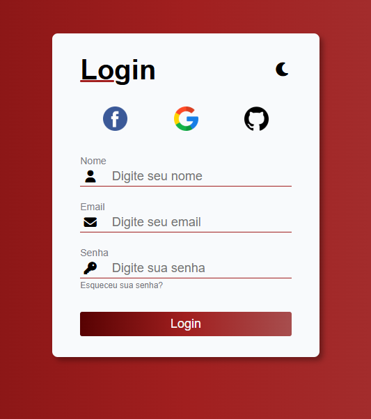
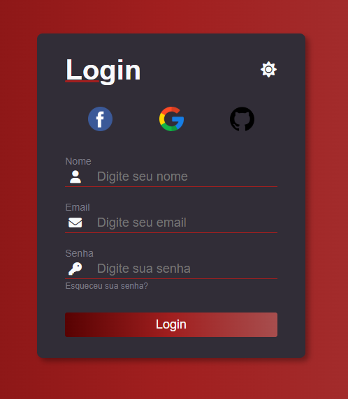

<div align="center">

# 🔐 Login Dark/Light Mode

Uma tela de login responsiva com alternância entre tema claro e escuro, construída com HTML, CSS e JavaScript puros.


[🔗 Ver Demo](https://login-dark-light-snowy.vercel.app)

</div>

---

## 📌 Sobre o Projeto

Este projeto é uma página de login com foco em **UI/UX**, criada para praticar fundamentos de front-end: responsividade, manipulação do DOM e alternância dinâmica de tema (dark/light) via ícone. A proposta não é autenticação real, é um formulário estático, sem back-end e sim um exercício de construção de interface limpa e funcional.

## 🖼️ Demonstração

<div align="center">

| Modo Claro | Modo Escuro |
|:---:|:---:|
|  |  |

</div>

> 💡 Acesse a [demo ao vivo](https://login-dark-light-snowy.vercel.app) para testar você mesmo.

## ✨ Funcionalidades

- 🌓 Alternância entre tema claro e escuro (ícone de lua/sol no cabeçalho)
- 📱 Layout responsivo (desktop, tablet e mobile)
- 🔑 Formulário com campos de Nome, Email e Senha (com validação nativa de tipo)
- 🔗 Atalhos de login social (Facebook, Google, GitHub)
- ↩️ Link para recuperação de senha

## 🛠️ Tecnologias

| Tecnologia | Uso |
|---|---|
|  | Estrutura da página |
|  | Estilização e responsividade |
|  | Lógica do toggle dark/light |
|  | Ícones (usuário, e-mail, chave, lua/sol) |

## 🚀 Como Executar

```bash
# Clone o repositório
git clone https://github.com/Geandysson/Login-Dark-Light.git

# Acesse a pasta do projeto
cd Login-Dark-Light

# Abra o index.html no navegador
# (ou use a extensão Live Server no VS Code)
```

Não há dependências para instalar é um projeto 100% front-end estático (o único recurso externo é o Font Awesome, carregado via CDN).

## 📂 Estrutura do Projeto

```
Login-Dark-Light/
├── assets/
│   ├── css/
│   │   └── style.css     # Estilos e temas (dark/light)
│   ├── js/
│   │   └── script.js     # Lógica de alternância de tema
│   └── images/            # Ícones e imagens usadas na interface
├── index.html              # Estrutura principal da página
```

## 🎯 Aprendizados

- Alternância de tema via manipulação de classes com JavaScript
- Boas práticas de responsividade com CSS
- Uso de bibliotecas de ícones externas (Font Awesome) via CDN
- Organização de projeto front-end simples e escalável

## 👤 Autor

**Geandysson**

[](https://github.com/Geandysson)

---